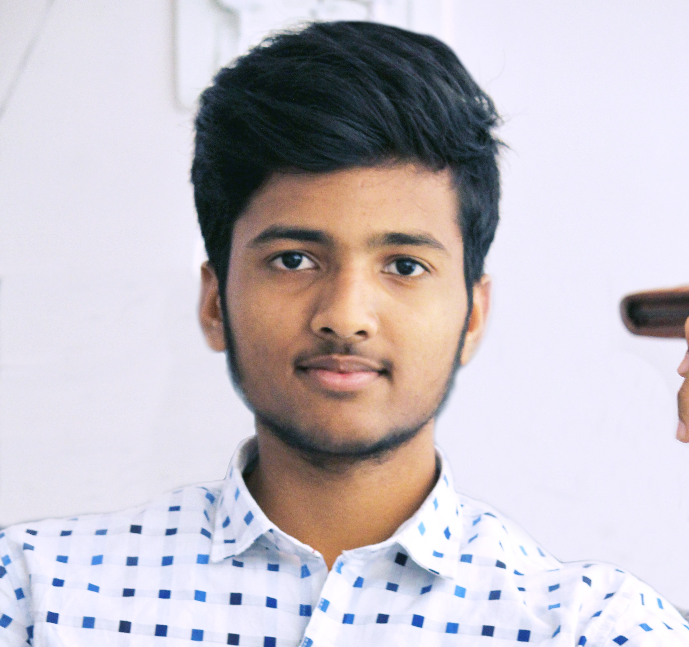

**Hello programmers!**

I am yogendra maarisetty from India  :india: , Hyderabad :100:. I am a **FullStack web developer** working at [Planful](https://www.planful.com). 
I would always love to share knowledge. So I have gathered Inofrmation and useful articles from popular resources like [GeeksForGeeks](https://www.geeksforgeeks.org/), [Youtube](https://www.youtube.com), [HackerEarth](https://www.hackerearth.com) etc....

**SKILL STACK**
- :fab fa-python:  Python3 
- :fab fa-java:  Java
- :fab fa-js-square:  JavaScript
- :fab fa-html5: HTML
- :fab fa-css3-alt: CSS
- :fab fa-bootstrap: sBootstrap
- :fab fa-react: Reactjs
- Django 3
- REST API (Django)
- :fab fa-node-js: NodeJS, ExpressJS

:fab fa-linkedin-in fa-fw:   [Linked in](https://www.linkedin.com/in/yogendra-maarisetty-991302171/)

:fab fa-github:  [Github](https://github.com/yogendramaarisetty)

:fab fa-hackerrank: [Hackerrank](https://www.hackerrank.com/yogendramaarise1)

